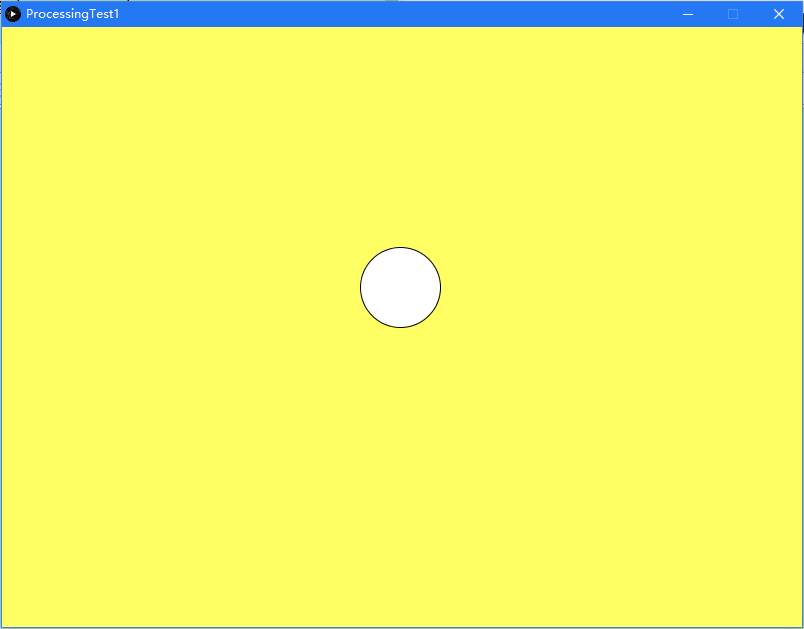

# Processing For Java

See https://github.com/processing/processing for more info.


#### 代码示例

```java
import processing.core.PApplet;

public class ProcessingTest1 extends PApplet {

    public static void main(String[] args) {
        main(ProcessingTest1.class);
    }


    @Override
    public void settings() {
        size(800, 600);
    }

    @Override
    public void draw() {
        background(mouseX, mouseY, 100);

        fill(255);
        ellipse(mouseX, mouseY, 80, 80);
    }
}
```


